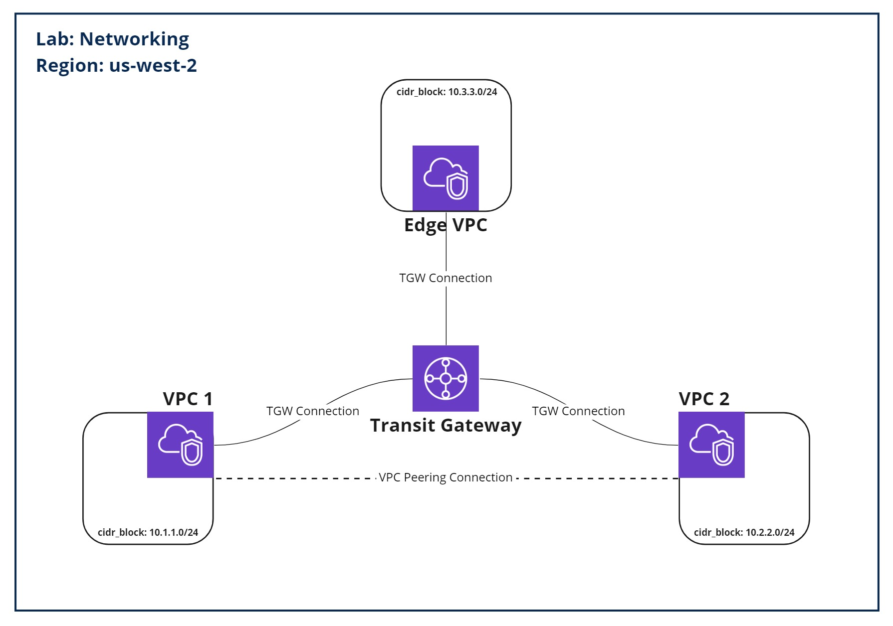

<!-- PROJECT LOGO -->
 
<h1> AWS Networking Lab </h1>

<!-- TABLE OF CONTENTS -->

  
Table of Contents

  <ol>
    <li>
      <a href="#lab-overview">Lab Overview</a>
      <ul>
        <li><a href="#business-case">Business Case</a></li>
        <li><a href="#object-creation-overview">Object Creation Overview</a></li>
        <li><a href="#guide">Guide</a>
        <ul>
          <li><a href="#terraform-object-creation">Terraform Object Creation</a></li>
          <li><a href="#aws-console-overview">AWS Console Overview</a></li>
        </ul>
        </li>
      </ul>
    </li>
  </ol>

## Lab Overview

Welcome to the Networking lab. 

### Business Case
A company needs to spin up three Virtual Private Clouds (VPCs) for increased isolation and regulatory concerns. Two of those VPCs will need a VPC peering connection between them, allowing duplex traffic flow. In addition, they would like a Transit Gateway (TGW) to serve as a central hub for the VPCs.

### Object Creation Overview

In this lab we will create the following:
* 3 x VPC objects
* 1 x VPC peering connection
* 1 x Transit Gateway object
* 3 x Transit Gateway connections
* 3 x Subnets, routing tables, routing table associations, and routes

A diagram is included below for convenience:

### Guide

Follow this guide to complete the networking lab portion of the AWS-200-bootcamp, the guide will focus on how to create the objects through Terraform, then it will overview how to review the objects created in the console and provide a high-level explanation on how to replicate this lab through console.

#### Terraform Object Creation

<ol>
  <li>
    First, we will provide example Terraform code for: VPC object, AWS Subnets, routing tables, and routes.
    <ol type="a">
      <li>
        VPC Object
        <ol type ="i">
          <li>
            Terraform code for a VPC object is shown below. Use this as one of your VPC objects, in future labs, this will be the VPC used to establish an internet gateway.
          </li>
          <li>
            <pre lang=json># Create AWS VPC Object edge vpc
            resource "aws_vpc" "edge_vpc" {
              cidr_block = "10.3.0.0/16" # Setting the CIDR block for the VPC
              tags = { # Setting tags (default tags as defined in variables gets appended to tags)
                Name = "edge_vpc"
              }
            }</pre>
          </li>
        </ol>
      </li>
      <li>
        Subnet
        <ol type ="i">
          <li>
            A sample subnet is shown below for the edge vpc defined earlier. The subnet does not affect the ending infrastructure of this lab instead it sets the foundations for routing and the ability to add compute to the VPCs in the future (i.e., EC2 Instances)
          </li>
          <li>
            <pre lang=json># Create AWS subnet for edge vpc
            resource "aws_subnet" "edge_vpc_subnet1" {
              vpc_id                  = aws_vpc.edge_vpc.id # Associating the subnet with a VPC
              cidr_block              = "10.3.3.0/24" # Setting a subnet within the VPCs CIDR block
              map_public_ip_on_launch = false
              availability_zone       = "${var.region}a"
              tags = {
                Name = "edge_vpc_subnet1"
              }
            }</pre>
          </li>
        </ol>
      </li>
      <li>
        Routing Table, Routing Table Association, and Route
        <ol type ="i">
          <li>
          A sample AWS Routing Table and its association is shown below. This gives outbound connections from the subnet a next-hop of the Transit Gateway. Note that in the route, the Transit Gateway object was not created so the association is left as [Your TGW] for you to fill in.
          </li>
          <li>
            <pre lang=json># Create Internal Route Table
            resource "aws_route_table" "edge_vpc_internal_rtable" {
              vpc_id = aws_vpc.edge_vpc.id
              tags = {
                Name = "edge_vpc_internal_rtable"
              }
            }
            # Create Routing Table Association
            resource "aws_route_table_association" "nat_internal_association" {
              # Associate the routing table with the subnet created for edge vpc
              subnet_id      = aws_subnet.edge_vpc_internal_subnet1.id
              route_table_id = aws_route_table.edge_vpc_internal_rtable.id
            }
            # Create AWS Route
            resource "aws_route" "edge_vpc_routes" {
            # Associate the route with the routing table just created for edge vpc
            route_table_id = aws_route_table.edge_vpc_internal_rtable.id
            # Set a destination IP block that includes the IPs of all over VPCs
            destination_cidr_block = "10.0.0.0/8"
            # Set a transit gateway as the destination next-hop
            transit_gateway_id     = aws_ec2_transit_gateway.[your TGW].id
            }</pre>
          </li>
        </ol>
      </li>
    </ol>
  </li>
  <li>
    Let's look at the objects you will have to create on your own. 
    <ol type="a">
      <li>
        2 x VPC Objects
        <ol type ="i">
          <li>
            The Terraform registry includes documentation for the <a href="https://registry.terraform.io/providers/hashicorp/aws/latest/docs/resources/vpc">VPC object</a>.
          </li>
        </ol>
      </li>
      <li>
        1 x VPC Peering
        <ol type ="i">
          <li>
            The Terraform registry includes documentation for the <a href="https://registry.terraform.io/providers/hashicorp/aws/latest/docs/resources/vpc_peering_connection">VPC Peering object</a>.
          </li>
        </ol>
      </li>
      <li>
        1 x Transit Gateway
        <ol type ="i">
          <li>
            The Terraform registry includes documentation for the <a href="https://registry.terraform.io/providers/hashicorp/aws/latest/docs/resources/ec2_transit_gateway">Transit Gateway object</a>.
          </li>
        </ol>
      </li>
      <li>
        3 x Transit Gateway attachment
        <ol type ="i">
          <li>
            The Terraform registry includes documentation for the <a href="https://registry.terraform.io/providers/hashicorp/aws/latest/docs/resources/ec2_transit_gateway_vpc_attachment">Transit Gateway attachment object</a>.
          </li>
        </ol>
      </li>
      <li>
        2 x Subnet
        <ol type ="i">
          <li>
            The Terraform registry includes documentation for the <a href="https://registry.terraform.io/providers/hashicorp/aws/latest/docs/resources/subnet">Subnet object</a>.
          </li>
        </ol>
      </li>
      <li>
        2 x Routing Table, Routing Table Association, and Route
        <ol type ="i">
          <li>
            The Terraform registry includes documentation for the following objects: <a href="https://registry.terraform.io/providers/hashicorp/aws/latest/docs/resources/subnet">Routing Table</a>, <a href="https://registry.terraform.io/providers/hashicorp/aws/latest/docs/resources/route_table_association">Routing Table Association</a>, and <a href="https://registry.terraform.io/providers/hashicorp/aws/latest/docs/resources/route">Route</a>.
          </li>
        </ol>
      </li>
    </ol>
  </li>
</ol>

#### Terraform execution

<ol>
  <li>
    Now that the Terraform objects have been created, let's talk about executing the terraform environment.
  </li>
  <li>
    Open up a terminal session in the directory with main.tf, use the following command to run a Terraform syntax test against your code.
    <pre lang=terraform>terraform validate</pre>
    The output of the command will either tell you which file and line numbers the error is located, this is useful to debug code and validate tat your object references are correct.
  </li>
  <li>
  Once your code is validated use the following command to build a terraform template.
  <pre lang=terraform>terraform plan -out=commit1</pre>
  A list of resources that are to be created will be displayed. In the future any changes to the infrastructure state will be documented through this output. It will list additions, alterations, and removals to the cloud environment. The -out flag is used to save the terraform plan to a file that you can reference later when committing the environment to the cloud.
  </li>
  <li>
  Finally we can use the following command to apply that terraform plan to the AWS environment.
  <pre lang=terraform>terraform apply commit1</pre>
  The plan file created is referenced so we can be sure that we're applying that documented infrastructure state to AWS.
  
  Once you've pushed your code to the cloud and have taken the time to test/prove the commit was effective, you can use this command to remove the applied resources and clean up the environment.
  <pre lang=terraform>terraform destroy commit1</pre>
  </li>
</ol>

#### AWS Console Overview

In this section we're going to familiarize ourselves with the AWS console so that we can take a look at the objects we just created and verify that they were created correctly.

Open up the <a href=https://console.aws.amazon.com>AWS Console</a> and login.

Let's take an example bit of Terraform code I want to double validate a succesful build on.
<pre lang=Terraform>resource "aws_subnet" "vpc1_subnet1" {
  vpc_id                  = aws_vpc.vpc1.id
  cidr_block              = "10.1.1.0/24"
  map_public_ip_on_launch = false
  availability_zone       = "${var.region}a"
  tags = {
    Name = "vpc1_subnet1"
  }
}</pre>
Inside the AWS portal to find this resource first you have to go into the VPC service and then the subnet subservice. <i>Note: Make sure you are on the correct region, by default this lab includes a region variable defined as US-West-2.</i>

Then I would take the name I have tagged the object with: <pre lang=Terraform> Name = "vpc1_subnet1"</pre> 
And enter that name in the filter to find my subnet Do this across your resources to validate that your terraform push was successful.

Once you've verified your push is successful and all the resources are up and error free, then <b>congratulations you have finished the networking module of AWS 200!</b>

